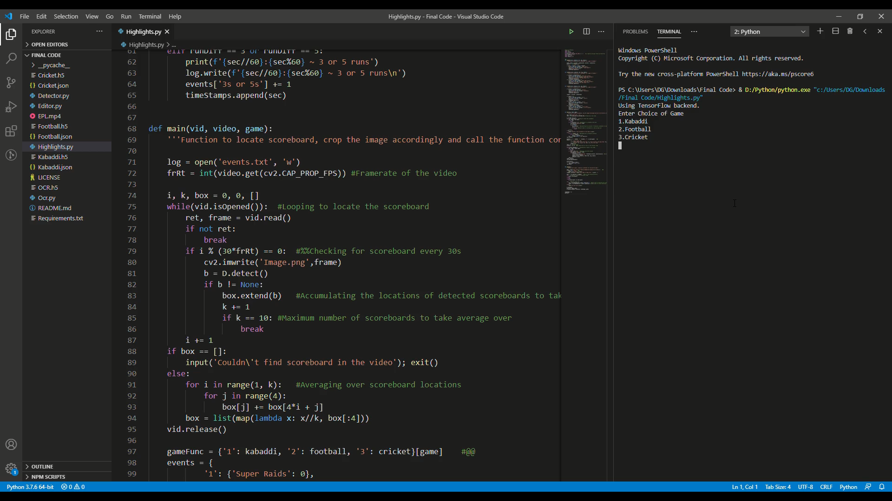
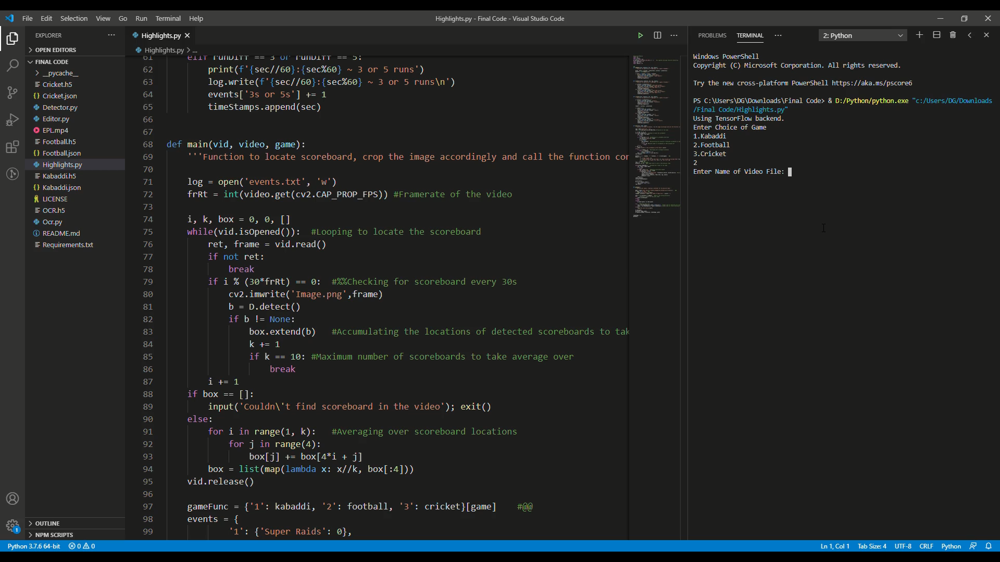
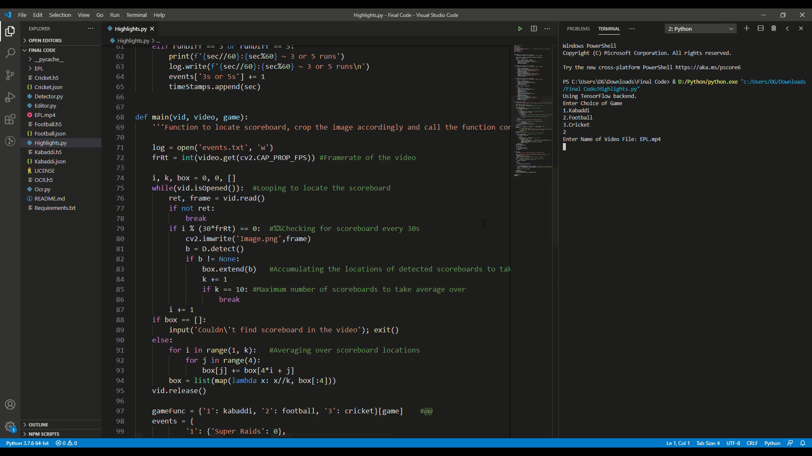
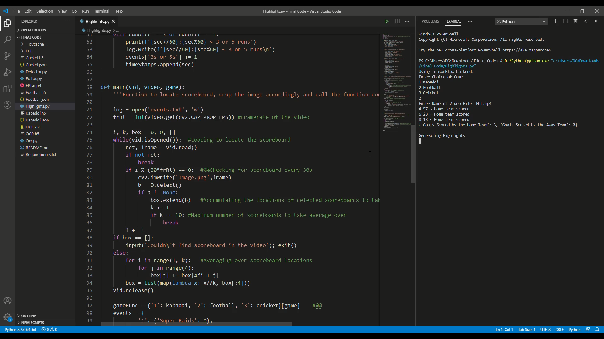
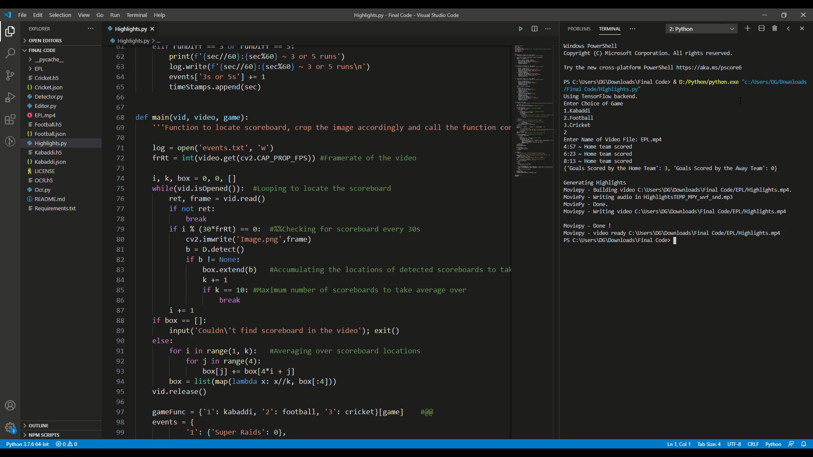

# AuViS
AuViS (Automated Video Summarization) was developed for the final year project of my Engineering curriculum. The code takes in a video of one of the supported sports videos and generates highlights of the said video. It uses ```YOLOv3``` to detect the location of the scoreboard and a custom trained convolutional nueral network as the OCR to extract the score out of the frame.

<br>

## Getting Started
* Clone this repository
* ```cd AuViS```
* Download the model and JSON files from ```Release v1.0```
* Install the required modules (```pip install -r requirements.txt```)
* Download and install Microsoft Visual C++
* Copy the desired video into this directory
* Run ```Highlights.py```

<br>

## How to Use
* Run ```Highlights.py``` with the desired video in the same directory
* Select the game
* Input the name of the video file (with extension)
* The output gets generated in a sub-directory of the same name as that of the video file
* You may tweak the lines marked as ```'#%%'``` in ```Highlights.py``` and ```Editor.py``` based on your preference

(Note: As of 2020, this works on latest editions of Bundesliga, English Premier League, Indian Pro Kabaddi, Indian Premier League, ICC Worldcup 2019)

<br>

## Example Output





